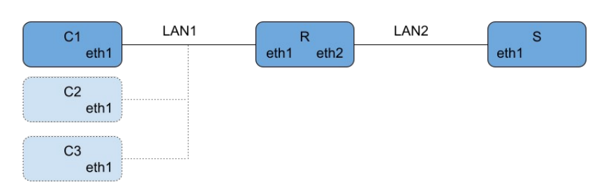

## Tools Involved

- Ansible
- Vagrant

- SNMP
- LDAP

- rsyslog
- systemd
- dnsmasq

  ## Tasks

**Network Configuration:**
- **Server ("S")**: Acts as a storage system for user data.
- **Clients ("Cx")**: Interface with Server "S".

Configure the following LAN networks as internal Virtualbox networks:
- **LAN1**:
  - Server (eth1): 10.200.1.1/24
  - Router (eth2): 10.200.1.254/24
- **LAN2**:
  - Router (eth1): 10.100.1.1/21
  - DHCP on Router assigns addresses to Clients in the 10.100.2.1 range.

Ensure correct routing of all traffic between Clients and Server.

**User Management:**
- Implement centralized login via LDAP with the directory server on the Router.
- Predefine a temporary user with a temporary group and a guest password.
- Install SSH keys to allow temporary passwordless connections.
- `/bin/ask.sh` script for user registration:
  - Prompts for a username (lowercase, non-existing in LDAP).
  - Displays available groups and prompts for group selection.
  - Creates the account with home directory `/tmp` and shell `/bin/bash`.
  - Generates and displays a random password (at least 6 characters).
  - Script executable only from temp.

**Monitoring:**
- Configure SNMP on Clients to monitor system load; trigger if load exceeds 4.
- Configure remote logging on Clients to write `local5.info` messages to `/var/log/alerts.log`.
- `/bin/monitor.sh` script on Server:
  - Runs every minute from 8am to 6pm on weekdays.
  - Queries all active Clients via SNMP.
  - Sends a "STOP" message via syslog to overloaded Clients.
- `/bin/watchdog.sh` script on Clients:
  - Starts at boot and automatically restarts if terminated abnormally.
  - Monitors `/var/log/alerts.log`.
  - Terminates all user processes with multiple active instances upon finding "STOP".
